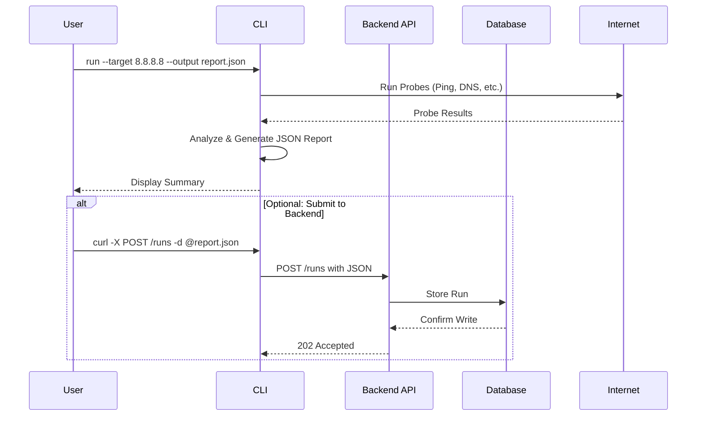
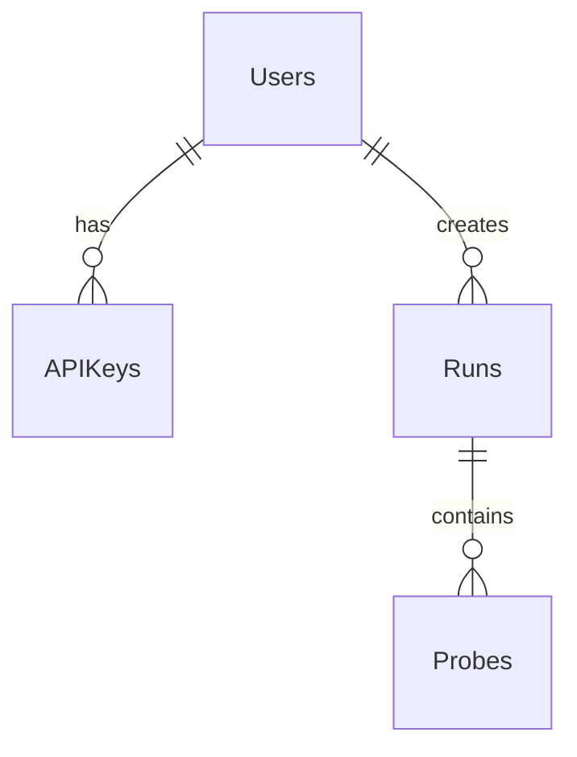

# Consolidated ISP Health Checker Documentation

## Table of Contents
1. [Executive Summary](#1-executive-summary)
2. [Architecture](#2-architecture)
    - [High-Level Design (HLD)](#21-high-level-design-hld)
    - [Low-Level Design (LLD)](#22-low-level-design-lld)
3. [Security](#3-security)
    - [Threat Model](#31-threat-model)
    - [OWASP Top 10 Assessment](#32-owasp-top-10-assessment)
    - [Compliance](#33-compliance)
4. [Operations](#4-operations)
    - [Runbook Highlights](#41-runbook-highlights)
    - [Monitoring Strategy](#42-monitoring-strategy)
5. [Reference](#5-reference)

---

## 1. Executive Summary

The **ISP Health Checker** is a modular, scalable, and extensible network diagnostics platform designed to detect, diagnose, and report instabilities in ISP connections. It provides network administrators and support personnel with a suite of tools to identify issues like packet loss, latency spikes, DNS problems, and upstream outages, enabling faster resolution and improved network reliability.

### Core Purpose
To empower NOC engineers, ISP support technicians, and SMB admins with a powerful, scriptable tool for network triage, scheduled monitoring, and evidence gathering for service provider escalations.

### Key Features
- **Multi-Probe Diagnostics:** Executes a battery of tests (Ping, Traceroute, DNS, HTTP, etc.).
- **Automated Diagnosis & Scoring:** Analyzes probe results to generate a simple health score (0-100) and a high-level diagnosis.
- **CLI-First Interface:** A powerful and scriptable command-line interface for running checks and exporting data.
- **Web UI Dashboard:** A minimal web interface for visualizing historical run data and detailed reports.
- **Prometheus Integration:** Exposes key metrics for integration with standard monitoring and alerting stacks.
- **Simulation Mode:** Allows for running the tool with pre-defined scenarios for testing and validation.

### System Components
The system is composed of:
- **CLI Probe Runner (`isp-checker`):** A self-contained Go binary for executing diagnostics.
- **Backend API (Python FastAPI):** A central service for ingesting, storing, and serving diagnostic reports.
- **Database (PostgreSQL):** Stores the JSON results from all diagnostic runs.
- **Web UI (React):** A browser-based SPA for data visualization.
- **Authentication Model:** Primarily API Keys, with optional OAuth support for v2.

---

## 2. Architecture

### 2.1. High-Level Design (HLD)

The system architecture is designed for modularity and scalability, with clear separation of concerns between its components.

#### System Components & Interactions
- **CLI Probe Runner:** Executes diagnostic probes (ping, traceroute, etc.) and formats results into a standard JSON schema. It can be run on-demand or as a scheduled job and includes a `--serve` mode for Prometheus metrics.
- **Backend API:** A REST/gRPC service that manages a worker pool for offloading probe execution, ingests results, and serves data via API endpoints.
- **Probe Worker Pool:** Background tasks managed by the Backend API to execute diagnostic runs without blocking the API.
- **Database:** Stores all diagnostic run data, with a retention policy to prune old data.
- **Web UI:** A SPA that communicates with the Backend API to display recent runs and detailed drilldowns.
- **Authentication:** Secures the backend API primarily with API keys.

#### Data Flow Diagrams


#### Deployment Targets
- **Development (Docker Compose):** A simple, one-command setup for local development.
- **Production (Kubernetes with Helm):** A scalable deployment using Deployments, Services, ConfigMaps, Secrets, and CronJobs for resilience and automation.

### 2.2. Low-Level Design (LLD)

The LLD provides the detailed technical specifications for implementation.

#### Module Boundaries and Interfaces
- **CLI Probe Module:** Implements a common `Result` interface for all probes (`RunPing`, `RunDNS`, `RunTraceroute`).
- **Backend Service Module:** Provides REST API endpoints for storing and retrieving reports, using Pydantic models for data validation.
- **Database Interface:** Defined using SQLAlchemy, with tables for `users`, `api_keys`, `runs`, and `probes`.

#### IPC Protocols and JSON Payload Format
The CLI and Backend communicate using a standardized JSON schema:
```json
{
  "run_id": "uuid-string",
  "timestamp": "2025-12-03T21:42:38Z",
  "target": "8.8.8.8",
  "mode": "full",
  "score": 85.5,
  "summary": "Connection appears healthy with minor latency",
  "probes": [ ... ],
  "diagnosis": [ ... ],
  "raw": { ... }
}
```

#### API Specifications
- **Submit Run:** `POST /api/v1/runs`
- **List Recent Runs:** `GET /api/v1/runs`
- **Get Run Details:** `GET /api/v1/runs/{run_id}`
- **Get Raw Probe Output:** `GET /api/v1/runs/{run_id}/raw`
All endpoints are secured with Bearer Token (API Key) authentication.

#### Database ERD


#### Configuration Management
- **Environment Variables:** For database URLs, secrets, and feature flags.
- **Configuration Files:** YAML files for detailed settings (e.g., `config.yaml` for the backend).
- **Loading Precedence:** CLI args > Environment Variables > Config File > Defaults.

#### Logging and Monitoring
- **Structured Logging:** JSON format with fields like `timestamp`, `level`, `service`, `component`, `message`.
- **Prometheus Metrics:** Exposes metrics for probe duration, status, API requests, and database queries.

#### Error Handling
- **CLI:** Captures probe errors, respects context cancellation, and degrades gracefully.
- **Backend:** Returns appropriate HTTP status codes (400, 401, 403, 404, 500) for different error conditions.

#### Security Considerations
- **API Security:** API key authentication, input validation, rate limiting.
- **Data Protection:** Password hashing, API key encryption, data retention policies.

#### Performance Considerations
- **CLI:** Concurrent probe execution, context cancellation.
- **Backend:** Database connection pooling, async operations, pagination.

---

## 3. Security

Security is a critical concern, addressed through a comprehensive threat model and adherence to best practices.

### 3.1. Threat Model

The system is analyzed using the STRIDE methodology.

| Threat Category | Threat Description | Mitigation Strategy |
| :--- | :--- | :--- |
| **Spoofing** | Attacker spoofs probe packets or forges API keys. | Prioritize TCP probes, run CLI with minimal privileges (`cap_net_raw`), use high-entropy API keys with rotation. |
| **Tampering** | Man-in-the-Middle alters probe results or database data is modified. | Enforce TLS 1.3, implement request payload signing (HMAC-SHA256), use secure database credentials and enable row-level security. |
| **Repudiation** | User denies performing a malicious action. | Implement an immutable, append-only audit log for all state-changing requests, shipped to a tamper-evident SIEM. |
| **Information Disclosure**| Unauthorized access to sensitive diagnostic reports. | Protect all API endpoints with API keys, enforce least privilege with Kubernetes NetworkPolicies, and return generic error messages. |
| **Denial of Service** | Attacker overwhelms the API or abuses the CLI for DDoS. | Deploy an API gateway with rate limiting, enforce request body size limits, configure HPAs, and implement target allow/denylists. |
| **Elevation of Privilege**| Vulnerability in a library allows code execution or lateral movement. | Run containers as non-root users, implement software supply chain security (scanning), and use RBAC and network segmentation. |

### 3.2. OWASP Top 10 Assessment

| OWASP Category | Assessment | Remediation Strategy |
| :--- | :--- | :--- |
| **A01: Broken Access Control** | Medium Risk. Relies solely on API keys. | Implement RBAC for API keys and enforce authorization checks. |
| **A02: Cryptographic Failures**| Low Risk. TLS is planned. | Enforce TLS 1.3 and configure transparent data encryption (TDE). |
| **A03: Injection** | Low Risk. Use of ORM and Pydantic models. | Continue using parameterized queries and validate all inputs. |
| **A04: Insecure Design** | Medium Risk. Accepts arbitrary network targets. | Implement strict target allowlisting/denylisting. |
| **A05: Security Misconfiguration**| Medium Risk. Kubernetes/Docker complexity. | Use admission controllers and scan for misconfigurations. |
| **A06: Vulnerable Components** | Medium Risk. Relies on numerous libraries. | Integrate dependency scanning into CI/CD. |
| **A07: Identification/Authentication Failures**| Medium Risk. Long-lived API keys. | Implement API key expiration and rotation. |
| **A08: Software/Data Integrity Failures**| Low-Medium Risk. No integrity check on data. | Implement request signing and secure CI/CD pipeline. |
| **A09: Security Logging/Monitoring Failures**| Medium Risk. Basic logging plan. | Implement comprehensive audit logging and ship to a SIEM. |
| **A10: Server-Side Request Forgery (SSRF)**| High Risk. Core function is a classic SSRF vector. | Critical mitigations: target allow/denylisting, sandboxed probes, restricted egress. |

### 3.3. Compliance

The system processes IP addresses and hostnames, which can be considered Personal Data under GDPR/LGPD.

- **Lawful Basis:** "Legitimate interests" for network monitoring.
- **Data Subject Rights:** Implemented via API endpoints for access, erasure (`DELETE /api/v1/data`), and data portability.
- **Data Protection by Design:** Data minimization (do not store `raw` output by default), aggressive retention policies (30 days for reports), and pseudonymization.

---

## 4. Operations

Operational excellence is achieved through detailed runbooks and a robust monitoring strategy.

### 4.1. Runbook Highlights

The runbook provides detailed procedures for common failure signatures, automated remediation, and incident management.

#### Failure Signatures
- **High Latency:** `isp_checker_probe_details{key="latency_avg_ms"}` > 150ms. Investigation involves checking consistency across targets and analyzing traceroute data.
- **Packet Loss:** `isp_checker_probe_details{key="loss_percent"}` > 2%. Investigation involves identifying the lossy hop in traceroute.
- **DNS Failures:** `isp_checker_probe_status{probe="dns",status="crit"}` = 1. Investigation involves testing against multiple resolvers.
- **Database Errors:** `isp_checker_api_requests_total{status="5xx"}` increasing. Investigation involves checking pod status and connectivity.

#### Automated Remediation
- **Retry Logic:** Configurable retry with exponential backoff for transient failures.
- **Circuit Breaker:** Prevents cascading failures by stopping calls to a failing service.
- **Self-Healing:** Automated recovery for database connection pools and DNS resolver failover.

#### Incident Management Workflow
1. **Triage:** Assess alert severity (P1-P4) and document initial findings.
2. **Investigation:** Collect metrics, logs, and run manual diagnostics to isolate the root cause.
3. **Resolution:** Implement immediate mitigation (restart, rollback) and plan permanent fixes.
4. **Post-Incident Review:** Conduct a blameless post-mortem to identify lessons learned and action items.

#### Performance Tuning
- **Probe Intervals:** Adaptive intervals based on target health (more frequent for critical targets).
- **Database Tuning:** Optimize connection pool settings and create indexes for common queries.
- **Resource Allocation:** Set appropriate CPU/memory requests and limits for containers.

#### Backup & Disaster Recovery
- **Strategy:** Automated daily database backups and configuration backups to cloud storage.
- **RTO/RPO:** 4 hours RTO, 1 hour RPO.
- **Procedures:** Documented steps for complete system recovery and partial recovery scenarios (database only).

### 4.2. Monitoring Strategy

A comprehensive monitoring setup using Prometheus and Grafana is essential for operational awareness.

#### Prometheus Metrics
All metrics follow the `isp_hc_<component>_<metric>_<unit>` naming convention.

- **CLI Metrics:**
  - `isp_hc_cli_runs_total`: Total runs initiated.
  - `isp_hc_cli_score`: Health score (0-100).
  - `isp_hc_cli_probe_status_total`: Probe result counts by status.
  - `isp_hc_cli_probe_details`: Numeric details (latency, loss).
- **Backend API Metrics:**
  - `isp_hc_api_requests_total`: API request counts.
  - `isp_hc_db_queries_total`: Database query counts.
  - `isp_hc_workers_active`: Number of active workers.

#### Alerting Rules
- **Critical Alerts:** High packet loss, low health score, API down.
- **Warning Alerts:** Elevated latency, high API latency, slow database queries.

#### Retention Policies
- **Health Scores:** 90 days for trend analysis.
- **Detailed Reports:** 30 days for troubleshooting.
- **Raw Histograms:** 7 days for high-resolution analysis.

---

## 5. Reference

This section provides links to the detailed documents that form the basis of this consolidation.

| Document | Description | Link |
| :--- | :--- | :--- |
| **Product Brief** | Overview, target personas, and core features. | [`docs/product_brief.md`](product_brief.md) |
| **High-Level Design (HLD)** | System components, data flows, and deployment. | [`docs/HLD.md`](HLD.md) |
| **Low-Level Design (LLD)** | Module interfaces, API specs, database schema. | [`docs/LLD.md`](LLD.md) |
| **Threat Model** | STRIDE analysis, OWASP assessment, compliance. | [`docs/Threat_Model.md`](Threat_Model.md) |
| **Operational Runbook** | Failure signatures, incident response, maintenance. | [`docs/Runbook.md`](Runbook.md) |
| **Metrics Specification** | Prometheus metrics, alerting rules, retention. | [`dashboards/prometheus_metrics.md`](../dashboards/prometheus_metrics.md) |