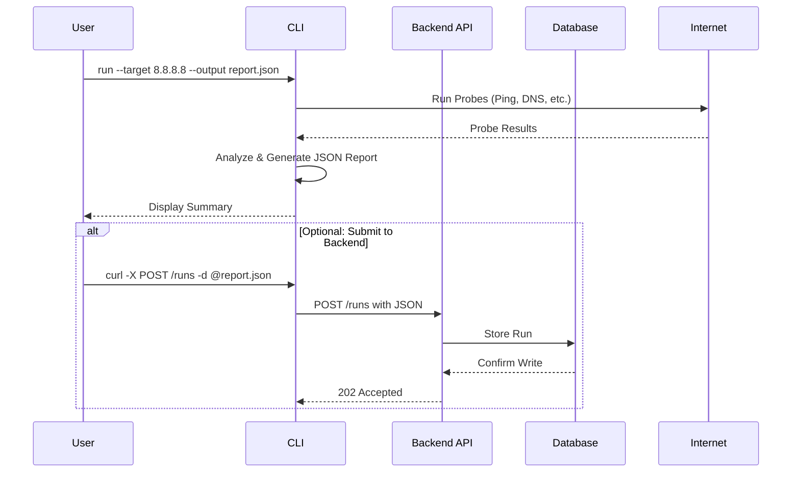
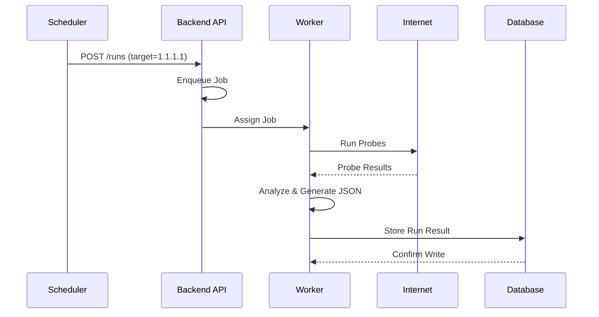

# High-Level Design (HLD): ISP Health Checker

## 1. Introduction

This document provides a high-level overview of the ISP Health Checker system architecture. It outlines the major components, their interactions, data flows, and deployment strategies. The system is designed to be a modular, scalable, and extensible platform for network diagnostics.

## 2. System Components

The system is composed of several key components that work together to provide a comprehensive health check and reporting service.

  <!-- Placeholder for a real diagram -->

*   **CLI Probe Runner (`isp-checker`):**
    *   A self-contained Go binary that executes the diagnostic probes (ping, traceroute, etc.).
    *   It can be run on-demand by a user or as a scheduled job.
    *   It formats results into the standard JSON schema and can output to stdout or a file.
    *   Includes a `--serve` mode to expose a Prometheus metrics endpoint for local monitoring.

*   **Backend API (Python FastAPI):**
    *   A central REST/gRPC service that ingests, stores, and serves diagnostic reports.
    *   Manages a worker pool for offloading probe execution when a run is initiated via the API.
    *   Provides endpoints for retrieving run history and raw data.
    *   Exposes aggregated Prometheus metrics for all runs it manages.

*   **Probe Worker Pool:**
    *   A pool of background tasks or processes managed by the Backend API.
    *   Each worker is responsible for executing a full diagnostic run requested via the API, preventing the API from blocking on long-running network tests.

*   **Database (PostgreSQL or SQLite):**
    *   Stores the JSON results from all diagnostic runs submitted to the backend.
    *   SQLite is suitable for small, single-node deployments, while PostgreSQL is recommended for larger, production environments requiring high availability and data integrity.
    *   A retention policy will be applied to prune old data.

*   **Web UI (React):**
    *   A minimal, browser-based single-page application (SPA).
    *   Communicates with the Backend API to display recent runs and detailed drilldowns.
    *   Provides a user-friendly interface for searching and visualizing historical data.

*   **Authentication Model:**
    *   **API Keys:** The primary method for securing the backend API. Clients (like the CLI or external scripts) must provide a valid API key in the request header.
    *   **OAuth (Optional):** For v2, OAuth 2.0 could be integrated to allow for user-level permissions on the Web UI and API, suitable for multi-tenant environments.

## 3. Data Flow Diagrams (Mermaid)

### 3.1. Live Diagnosis (CLI Initiated)

This flow describes a user running a check and optionally submitting it to the backend.

### 3.2. Scheduled Health Job (Backend Initiated)

This flow describes a run initiated via the API or a scheduled job managed by the system.

## 4. Deployment Targets

The application is designed to be deployed in various environments, from local development to production Kubernetes clusters.

*   **Development (Docker Compose):**
    *   A `docker-compose.yml` file will orchestrate the `backend`, `ui`, and `postgres` services.
    *   This provides a simple, one-command setup for local development and testing.
    *   The CLI can be run from the host machine or another container.

*   **Production (Kubernetes with Helm):**
    *   A Helm chart will manage the deployment of all components into a Kubernetes cluster.
    *   **`Deployment`:** For the Backend API and Web UI pods.
    *   **`Service`:** To expose the API and UI to internal or external traffic.
    *   **`ConfigMap`:** To manage application configuration and environment variables.
    *   **`Secret`:** To store the database password and API keys.
    *   **`CronJob`:** For running scheduled health checks against critical endpoints.
    *   **`PersistentVolumeClaim`:** For the PostgreSQL database to ensure data persistence across pod restarts.
